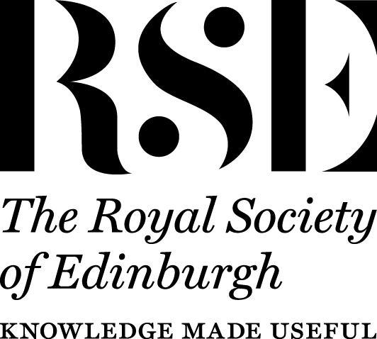

# Background

The automatic or semiautomatic analysis of textual data is a key approach to analyse the massive amounts of user-generated content online, from the identification of sentiment in text and topic classification to the detection of abusive language, misinformation or propaganda. However, the development of such systems faces a crucial challenge. Static benchmarking datasets and performance metrics are the primary method for measuring progress in the field, and the publication of research on new systems typically requires demonstrating an improvement over state-of-the-art approaches in this way. Yet, these performance metrics can obscure critical failings in current models. Improvements in metrics often do not reflect improvements in the real-world performance of models. There is clearly a need to rethink performance evaluation for text classification and analysis systems to be usable and trustable.

## Overview

If unreliable systems achieve astonishing scores with traditional metrics, how do we recognise progress when we see it? The goal of the workshop on Novel Evaluation Approaches for Text Classification Systems (NEATCLasS) is to promote the development and use of novel metrics for abuse detection, sentiment analysis and similar tasks within the community, to better be able to measure whether models really improve upon the state of the art, and to encourage a wide range of models to be tested on these new metrics.

## Organisers

  

    
    
 <a href="https://sweb.inf.ed.ac.uk/bross3/">Björn Ross</a> 

    
 he/him 

    
 The University of Edinburgh 

  

  

  	
  	
 <a href="https://www.diag.uniroma1.it/navigli/">Roberto Navigli</a> 

  	
 he/him 

    
 Sapienza University of Rome 

  

  

  	
    
 <a href="https://ago3.github.io">Agostina Calabrese</a>

    
 she/her 

    
 The University of Edinburgh 

  

This workshop was supported by the RSE Saltire Facilitation Network Award, Ref. No. 1901.

