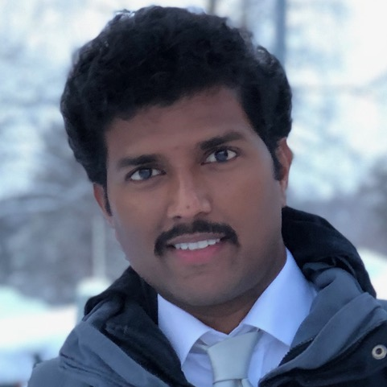

# Registration

Registration is managed by ICWSM at <a href="https://www.icwsm.org/2023/index.html/#registration">https://www.icwsm.org/2023/index.html/#registration</a>.

Note that it is possible to register for the workshop only at a much lower rate than the full-conference fees.

# Programme

The workshop will be held as a half-day meeting on 5th June 2022 from 14:00-17:30 Nikosia time (UTC+3) in hybrid mode.

We are looking forward to an exciting mix of activities including invited speakers and paper presentations. The schedule will be finalised closer to the time. Follow us on Twitter at [@bjoernross](https://twitter.com/bjoernross), [@rnavigli](https://twitter.com/rnavigli), [@agostina_cal](https://twitter.com/agostina_cal), [@zzz2aaa](https://twitter.com/zzz2aaa) to stay up to date!

While we highly encourage in-person attendance, we are planning to live stream the workshop on Zoom.

## Keynote: Kiran Garimella

	

	    
	

	

	  	
 
Kiran Garimella is an Assistant Professor in the School of Communication and Information at Rutgers University. His research deals with using large-scale data to tackle societal issues such as misinformation, political polarization, and hate speech. Prior to joining Rutgers, Dr. Garimella was the Michael Hammer postdoc at the Institute for Data, Systems and Society at MIT and a postdoc at EPFL, Switzerland. His work on studying and mitigating polarization on social media won the best paper awards at top computer science conferences. Kiran received his Ph.D. in computer science at Aalto University, Finland, and Masters & Bachelors from IIIT Hyderabad, India. Prior to his Ph.D., he worked as a Research Engineer at Yahoo Research, Barcelona, and QCRI, Doha. 

	

